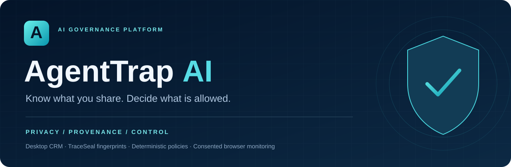
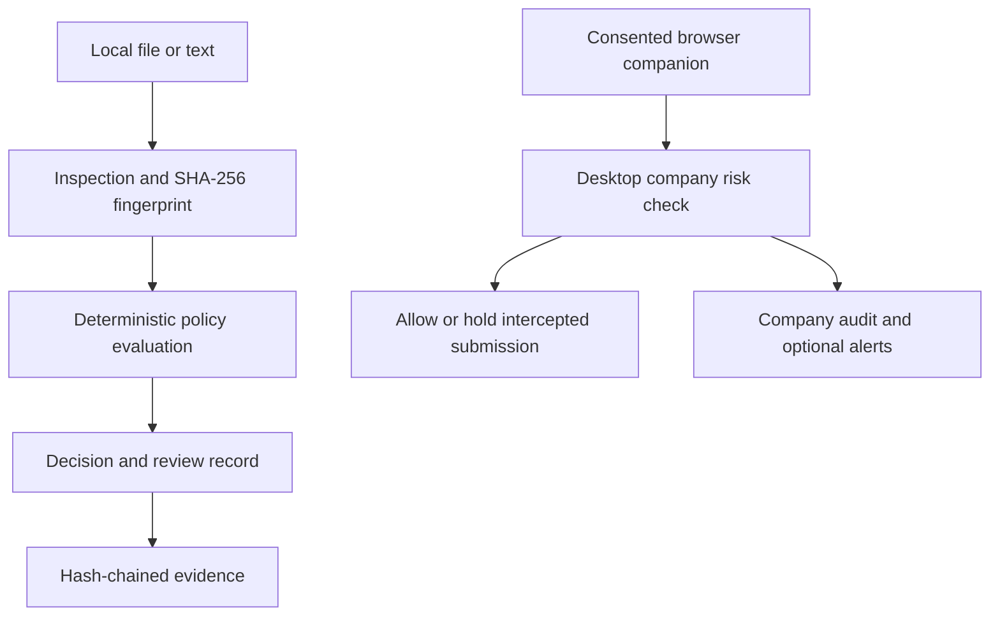

<div align="center">



**A governance workspace for safer AI use.**

Inspect sensitive assets, apply explicit policies, and preserve evidence of the decisions that matter.


[**Explore the website**](https://agenttrap-ai-governance.arceus6667.chatgpt.site/) · [**Try the demo**](https://agenttrap-ai-governance.arceus6667.chatgpt.site/demo.html) · [**Download CRM**](https://agenttrap-ai-governance.arceus6667.chatgpt.site/downloads.html) · [**Read the test report**](docs/verification-0.3.1.md)

</div>

---

## The idea

AI adoption creates a practical security question: **what is being shared, with whom, and under which policy?**

AgentTrap AI brings document checks, asset fingerprints, policy decisions, company accounts, and consented browser observations into one workspace. It helps teams inspect information before using it with AI and retain a record of the checks performed.

> **Detection provides evidence. Deterministic policies determine the outcome.**
>
> This repository contains a working hackathon evaluation. Features marked as implemented are distinct from production requirements and future capabilities.

## Inside the workspace

| Layer | What it does |
| :--- | :--- |
| **Exposure Intelligence** | Inspects supported text for credential, email, and prompt-manipulation patterns; calculates risk and confidence estimates. |
| **TraceSeal Provenance** | Registers SHA-256 fingerprints, compares exact file bytes, and records asset/version relationships. |
| **Runtime Policy Engine** | Evaluates classification, purpose, destination, and role against priority-ordered rules. |
| **Approval Queue** | Records reviewer decisions and reasons for assets requiring review. |
| **Enterprise Accounts** | Supports verified identities, company workspaces, invitations, owner/admin/member roles, and shared activity records. |
| **Browser Companion** | Observes approved AI pages with consent and checks intercepted prompt/file submission controls. |
| **Audit & Alerts** | Preserves hash-chained evidence; provides dashboard alerts, OS notifications where supported, and optional ntfy phone push. |

### Four explicit outcomes

| Outcome | Meaning |
| :--- | :--- |
| 🟢 **ALLOW** | The evaluated request satisfies the active decision rules. |
| 🔵 **MONITOR** | Retain evidence and monitor elevated exposure. |
| 🟠 **APPROVAL_REQUIRED** | Request review because a policy or evidence condition requires it. |
| 🔴 **BLOCK** | A blocking rule or risk boundary applies. |

The console's analytical outcomes are separate from desktop browser enforcement. Company threshold holds apply only to submission controls intercepted by the paired companion on approved pages.

## How it fits together



**Privacy model:** document-analysis bytes remain in the browser or desktop process. The desktop persists per-user metadata locally. Verified accounts, company membership, licenses, and consented browser audit observations use protected Supabase records. Optional redacted previews require separate consent.

## Choose your experience

| Capability | Web Demo | Desktop Trial | Full Hackathon |
| :--- | :---: | :---: | :---: |
| Document checks and asset fingerprints | ✓ | ✓ | ✓ |
| TraceSeal comparison and audit export | ✓ | ✓ | ✓ |
| Custom policies and approval workflows | ✓ | Limited | ✓ |
| Local desktop metadata persistence | — | ✓ | ✓ |
| Browser pairing and observed activity | — | — | ✓ |
| Company threshold holds | — | — | ✓ |
| Optional phone push configuration | — | — | ✓ |
| Access boundary | 5 min guest / 30 min signed in | 5 analysis/registration operations, 3 integrity checks, 2 fixed policies | Verified company account + active evaluation or operator-issued license |

New company workspaces receive a **seven-day hackathon evaluation**. Downloading the Full edition does not establish a paid entitlement. The proposed ₹90,000 commercial offering has no checkout in this release; paid activation requires operator verification.

## Download and get started

**Windows users receive an actual `.exe` installer.** No Node.js installation or ZIP extraction is needed for the native Windows app.

- [Windows x64 · Full](https://github.com/arceus6667-art/ALGORITHM-X-ACM-HACK-005/releases/download/desktop-v0.3.1/AgentTrap-0.3.1-win-x64-full.exe)
- [Windows x64 · Trial](https://github.com/arceus6667-art/ALGORITHM-X-ACM-HACK-005/releases/download/desktop-v0.3.1/AgentTrap-0.3.1-win-x64-trial.exe)
- [All releases and architectures](https://github.com/arceus6667-art/ALGORITHM-X-ACM-HACK-005/releases)

Native build targets include Windows 10/11 x64 and ARM64, macOS Intel and Apple Silicon, and Linux x64 and ARM64. macOS packages are ZIPs; Linux packages are TAR.GZ files. Assets appear after their builds complete. These evaluation packages are unsigned; production distribution needs trusted signing and platform-specific validation.

### Your first fingerprint check

1. Install the edition matching your system and open AgentTrap CRM.
2. **Register** with your name and company email, then request a magic link.
3. Open the email link on the same laptop while the CRM stays open.
4. Create your company workspace or accept an administrator invitation.
5. Open **TraceSeal provenance**, choose an original file and classification, then select **Register fingerprint**.
6. Choose a candidate file and select **Compare fingerprints**.

**Same bytes → Exact Match. Changed bytes → Review required.** Registration supports images and PDFs for hashing, with a 10 MB file limit. A hash verifies byte identity; it does not prove ownership or permission.

### Connect approved AI websites

Full edition supports consented observation on **ChatGPT, Claude, Gemini, Microsoft Copilot**, and an explicitly approved internal HTTPS domain.

1. [Download the browser companion](https://agenttrap-ai-governance.arceus6667.chatgpt.site/downloads/AgentTrap-browser-companion.zip) and extract it.
2. In Chrome or Edge, open Extensions, enable Developer mode, and select **Load unpacked**.
3. In the CRM, open **AI pairing & alerts → Create pairing code**.
4. Enter the code in the companion and approve only the websites you want observed.
5. Accept monitoring consent in the CRM and enable monitoring. Reload the approved AI page.
6. Review **Browser activity** and company records. Configure company risk boundaries to enable intercepted submission holds.

The CRM must remain open. Restarting requires pairing again. Test with synthetic data; real provider interfaces may need selector updates.

## Risk scoring, explained

```text
Risk = 100 × (0.30S + 0.20D + 0.20A + 0.15P + 0.15V)
```

| Factor | Represents |
| :---: | :--- |
| **S** | Data sensitivity and configured detection signals |
| **D** | Internal or external destination |
| **A** | Intended action, such as training or summarization |
| **P** | Matching policy restrictions |
| **V** | User-declared provenance assurance |

Factors range from 0 to 1. Bands are **Low 0–25**, **Moderate 26–50**, **High 51–75**, and **Critical 76–100**. Scoring and confidence are prototype estimates, not calibrated guarantees.

Console decision precedence: **credential protection → first matching custom policy → evidence review → risk threshold → monitor/allow**.

## Build from source

Use **Node.js 24+** and npm.

```bash
git clone https://github.com/arceus6667-art/ALGORITHM-X-ACM-HACK-005.git
cd ALGORITHM-X-ACM-HACK-005
npm ci
npm run build
npm test
```

Launch the portable desktop CRM from the repository:

```bash
node desktop/launch.mjs
```

The launcher opens your browser and binds to `127.0.0.1:43127`. Real sign-in and company access require the configured backend and internet access.

For Electron development:

```bash
npm ci --prefix desktop
npm --prefix desktop start
```

Website build output is a Cloudflare-compatible Worker under `dist/server/index.js`. Web trial timing uses D1; account and company operations use Supabase. Deployment configuration is environment-specific; see `.env.example` and the setup guides below. Keep SMTP passwords and secret/service-role keys out of browser code and commits.

## Repository map

| Path | Purpose |
| :--- | :--- |
| [`web/`](web/) | Landing pages, governance console, enterprise portal, and download UI |
| [`client/`](client/) | Browser authentication integration |
| [`desktop/`](desktop/) | Electron shell, loopback service, account handling, and desktop controls |
| [`extension/`](extension/) | Chrome/Edge companion and approved-site observation |
| [`worker/`](worker/) | Website APIs, trial enforcement, and workspace gateway |
| [`supabase/`](supabase/) | Company/account schema, access controls, and domain-verification function |
| [`db/`](db/) / [`drizzle/`](drizzle/) | Website trial schema and migrations |
| [`scripts/`](scripts/) | Build, packaging, and interaction/service tests |
| [`docs/`](docs/) | Activation instructions and verification evidence |

## Verification and current boundaries

**Eight automated tests pass in the 0.3.1 verification run.** They cover TraceSeal registration/comparison, saved metadata, policy controls, approvals, audit tamper detection, magic-link account gating, desktop quotas, web expiry, browser permissions, simulated submission holds, and mocked notification transport. GitHub Actions runs the verification gate before native release builds.

[Read the complete verification report and live acceptance checklist →](docs/verification-0.3.1.md)

<details>
<summary><strong>What still needs live or production validation?</strong></summary>

- Live ChatGPT/Claude interactions on a paired user laptop and actual phone notification receipt remain separate acceptance tests.
- Monitoring covers approved browser controls, not every application, folder, device, historical conversation, or downstream provider action.
- Folder-tree watching, automatic image/PDF/Office text extraction, and visual similarity matching are not implemented.
- SHA-256 changes when file bytes change, including resizing or recompression. It cannot reveal provider retention, model training, or downstream reuse.
- Audit chaining detects changed records relative to trusted evidence; it is not a digital signature or independent timestamp.
- Native notifications depend on OS support and permissions. ntfy configuration requires an authenticated private topic; push tokens stay in memory.
- Commercial checkout, automatic paid entitlement issuance, trusted installer signing, and macOS notarization are not implemented.

</details>

## Setup guides

- [Authentication and magic-link configuration](AUTH_SETUP.md)
- [Company activation, domain verification, and operating requirements](docs/enterprise-activation.md)
- [Desktop installation, permissions, privacy, and alerts](desktop/README.md)
- [Verification report and acceptance tests](docs/verification-0.3.1.md)
- [Demo terms and privacy](https://agenttrap-ai-governance.arceus6667.chatgpt.site/terms.html)

---

<div align="center">

**AgentTrap AI**

*Privacy. Provenance. Control.*

[Explore](https://agenttrap-ai-governance.arceus6667.chatgpt.site/) · [Download](https://agenttrap-ai-governance.arceus6667.chatgpt.site/downloads.html) · [Documentation](docs/)

</div>

### Admin exposure simulation · desktop 0.3.2

A separate sandbox rehearses six policy, credential, modified-file, internal-use, checker-offline and hypothetical onward-transfer scenarios. It includes fictional employees, step-by-step/animated timelines, incident acknowledgement/review and clearly labelled evidence exports. Actual company membership can be loaded as a read-only reference using existing permissions. No live provider requests, notifications, system-wide blocking or production audit writes occur.

See the [complete administrator and employee operating guide](docs/operator-guide.md). The companion now shows prominent pairing and enabling success messages (extension 0.2.0).
